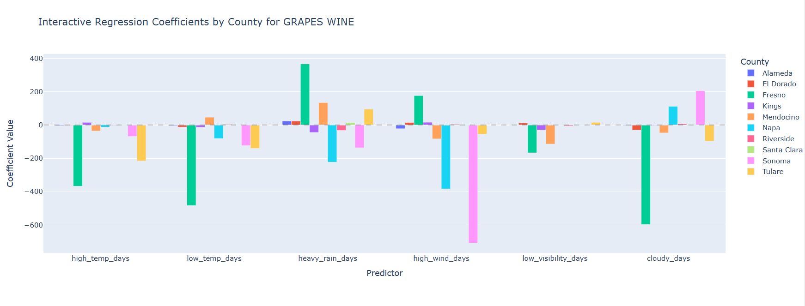
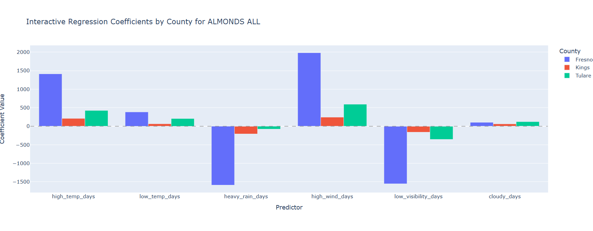
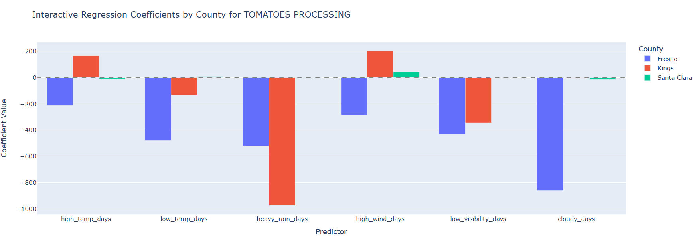
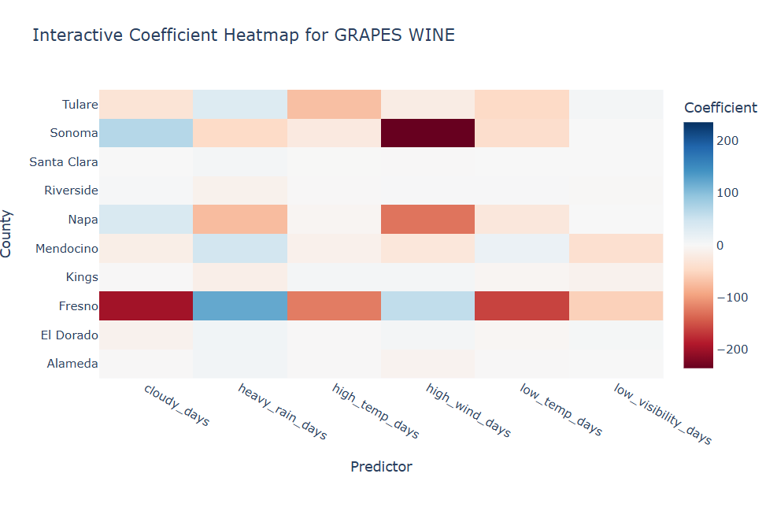
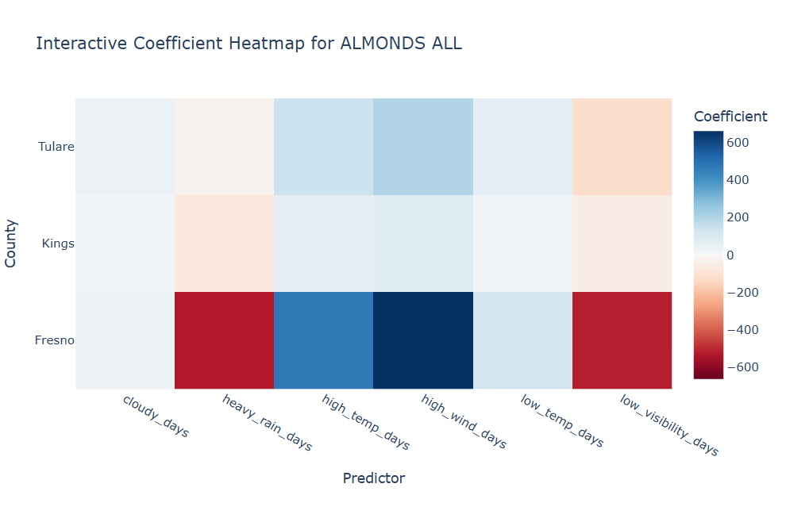
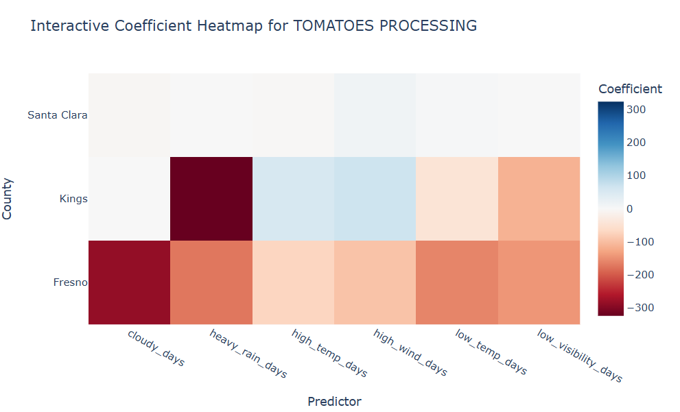
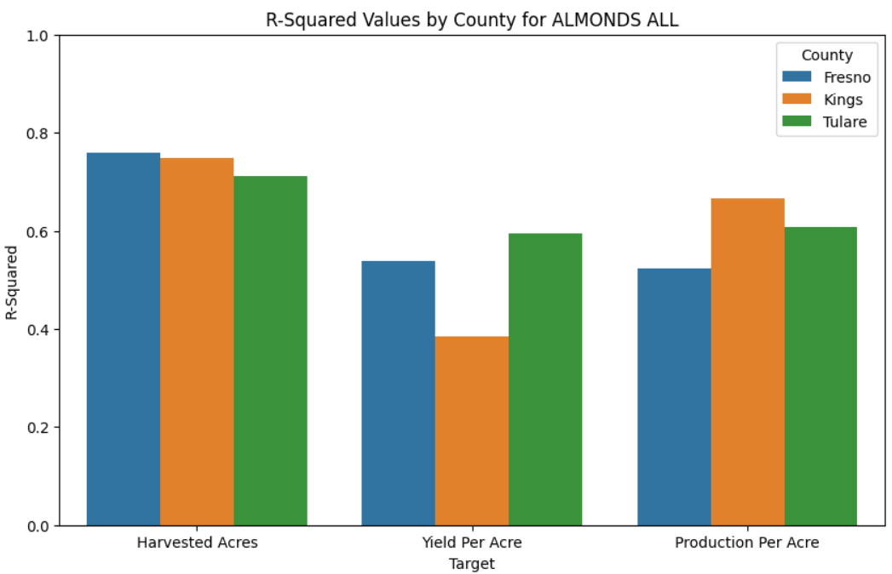
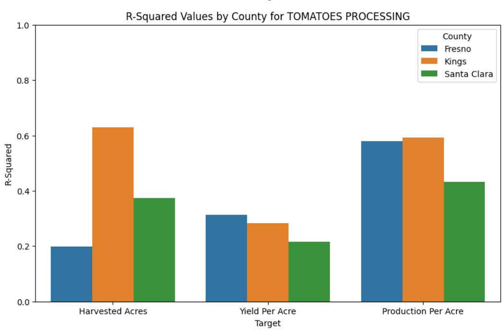
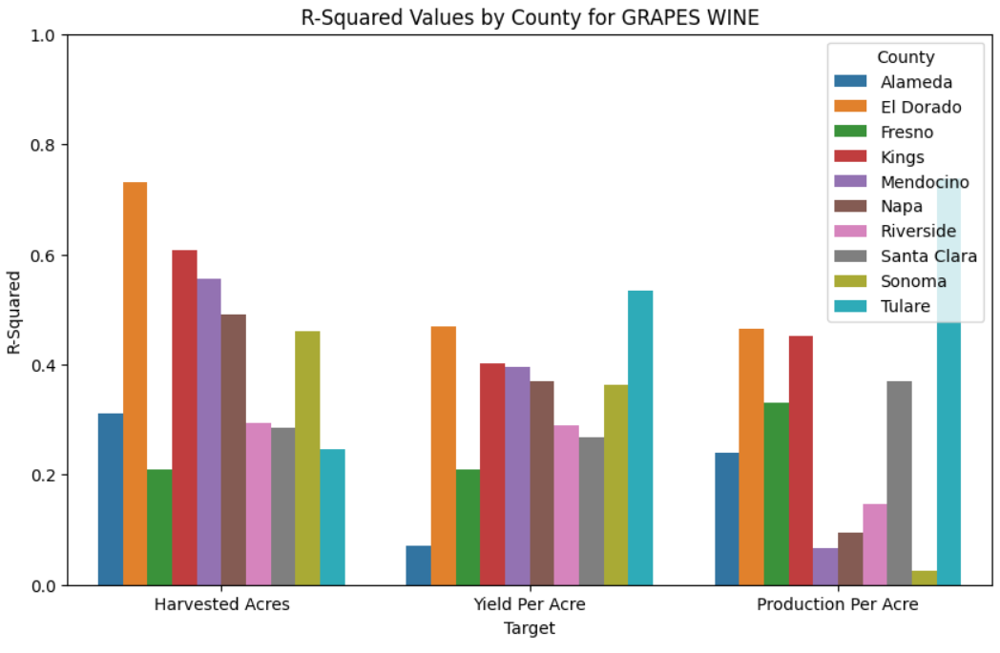

# Proposal: Fresno Weather Data Analysis and Forecasting

### **Project Goals:**
The primary goal of this project is to analyze the impact of extreme weather conditions on crop yields, production, and harvested acres across multiple counties in California. Specifically, the project aims to:

1. **Assess the Relationship Between Extreme Weather and Crop Outcomes:**
   - Perform statistical analyses to test the hypothesis that extreme weather events significantly affect crop yield, production per acre, and harvested acres.
   - Identify which weather variables have the most substantial impact on different crops and counties.

2. **Develop Predictive Models for Crop Yields:**
   - Build machine learning models capable of predicting future crop yields based on historical weather data and crop performance.
   - Incorporate significant weather features, as well as lagged weather and crop variables, to enhance model accuracy.

By achieving these goals, the project seeks to provide valuable insights and tools that can help farmers and agricultural planners mitigate risks associated with extreme weather events and optimize crop management strategies.

### **Specific Crops and Timeframe:**
The project focuses on a selection of economically important crops in California, utilizing data from **1980 to the present**. The crops and counties analyzed include:

- **Almonds:**
  - **Counties:** Fresno, Kings, Tulare
  - **Sensitivity:** Highly sensitive to temperature extremes and water availability.

- **Grapes (Wine):**
  - **Counties:** Alameda, El Dorado, Fresno, Kings, Mendocino, Napa, Riverside, Santa Clara, Sonoma, Tulare
  - **Sensitivity:** Affected by temperature fluctuations, rainfall patterns, and extreme weather events like high winds.

- **Tomatoes (Processing):**
  - **Counties:** Fresno, Kings, Santa Clara
  - **Sensitivity:** Influenced by temperature variations and precipitation levels.

The analysis covers these crops across the specified counties to capture a diverse range of climatic conditions and agricultural practices.

### **Key Features:**

1. **Data Integration and Feature Engineering:**
   - Merged daily and yearly weather datasets with crop yield data based on date and location.
   - Created new features to quantify extreme weather levels, using location-specific thresholds based on historical weather statistics.
   - Calculated extreme weather metrics such as high-temperature days, heavy rain days, high wind days, and others for each year and location.

2. **Statistical Analysis and Hypothesis Testing:**
   - Tested the hypothesis that extreme weather significantly affects crop outcomes using regression analyses for each county-crop combination.
   - Identified significant weather predictors for harvested acres, yield per acre, and production per acre.
   - Assessed the direction and magnitude of the impact of extreme weather variables on crop performance.

3. **Development of Predictive Models:**
   - Built machine learning models (Random Forest, Lasso, Ridge, Support Vector Regressor) to predict future crop yields based on significant weather features.
   - Incorporated lagged weather and crop variables to capture temporal dependencies and improve model performance.
   - Evaluated model performance using metrics such as R-squared and Root Mean Squared Error (RMSE), and compared results across different models, counties, and crops.

4. **Visualization and Interpretation:**
   - Generated correlation matrices and heatmaps to visualize the relationships between weather variables and crop outcomes.
   - Created plots to compare model performance across counties and crops, aiding in the interpretation of results.

### **Project Outcome and Usefulness:**
- **Insights into Weather-Crop Relationships:**
  - The project provides a detailed understanding of how extreme weather events impact different crops in various counties.
  - Identifies specific weather variables that significantly affect crop yield and production, helping target areas for risk mitigation.

- **Predictive Modeling Tools:**
  - Developed predictive models that can forecast future crop yields based on historical weather patterns and crop performance.
  - These models can assist farmers and agricultural planners in anticipating potential yield fluctuations due to extreme weather.

- **Data-Driven Decision Support:**
  - By highlighting the most impactful weather factors, the project enables more informed decision-making regarding crop management, irrigation scheduling, and resource allocation.
  - Supports scenario planning by simulating how changes in weather patterns might affect future crop outcomes.

### **User Implementation and Benefits:**

#### **1. Analytical Dashboard and Reporting:**
   - **Implementation:** Develop a user-friendly dashboard that presents key findings, visualizations, and predictive analytics.
     - Users can explore interactive charts showing the relationship between extreme weather events and crop performance.
     - The dashboard can provide county-specific insights and allow users to filter by crop type and weather variables.
   - **Benefit:** Enables farmers, agronomists, and policymakers to easily access and interpret complex data analyses, facilitating evidence-based strategies.

#### **2. Predictive Alerts and Recommendations:**
   - **Implementation:** Integrate predictive models to generate alerts when forecasts indicate potential adverse impacts on crop yields.
     - Alerts can be customized based on thresholds for significant weather variables identified in the analysis.
     - Provide recommendations for mitigating actions, such as adjusting planting dates or enhancing irrigation during expected high-temperature periods.
   - **Benefit:** Empowers users to take proactive measures to protect crops, optimize yields, and reduce economic losses due to extreme weather.

#### **3. Strategic Planning Tools:**
   - **Implementation:** Offer scenario analysis features that allow users to simulate the effects of different weather patterns on crop yields.
     - Users can adjust variables like temperature or precipitation levels to see projected impacts on specific crops.
   - **Benefit:** Assists in long-term agricultural planning, helping stakeholders adapt to climate variability and make resilient choices.

### **Data Sources:**

1. **Historical Weather Data:**
   - **Datasets Used:** Daily and yearly weather data (`weather.csv`, `weather_yearly.csv`).
   - **Content:** Includes temperature, precipitation, wind speed, visibility, cloud coverage, and calculated extreme weather features based on city-specific thresholds.
   - **Usage:** Used to engineer features that quantify extreme weather events and analyze their impact on crop outcomes.

2. **Crop Yield Data:**
   - **Datasets Used:** Crop production data (`crops.csv`) from various counties in California.
   - **Content:** Contains information on harvested acres, yield, production, and price per unit for specific crops.
   - **Usage:** Merged with weather data to assess the relationship between weather variables and crop performance metrics.

3. **Data Processing and Analysis Methods:**
   - **Feature Engineering:** Developed location-specific thresholds for extreme weather based on statistical percentiles.
   - **Regression Analysis:** Performed multiple regression models to identify significant predictors of crop outcomes.
   - **Machine Learning Models:** Implemented models incorporating significant weather features, lagged weather variables, and lagged crop variables to enhance predictive accuracy.
   - **Visualization Tools:** Used correlation matrices, heatmaps, and performance plots to interpret and present findings effectively.

#### **Data Sources:**
The project will utilize the following key data sources:

1. **NOAA Climate Data:** Provides comprehensive historical weather data, including temperature and precipitation records, essential for analyzing long-term climate trends and patterns in Fresno.

2. **OpenWeatherMap API:** Offers real-time weather data, including current temperature and precipitation, crucial for accurate short-term weather forecasts and anomaly detection.

3. **USDA Crop Yield Data:**
   - Data Available: Provides historical crop yield data for **almonds** and **tomatoes** in Fresno County.
   - Timeframe: Crop yield data from 1980 to the present.

### **Expected Major Findings**

This project is expected to yield several key findings related to the **relationship between extreme weather variables and crop yields** across various counties in California. By developing and evaluating predictive models, these findings will provide insights into the impact of weather conditions on crop outcomes, particularly for **almonds, wine grapes, and processing tomatoes**. Below are the main areas of exploration and the anticipated outcomes:

#### **1. Identification of Significant Weather Variables and Their Impact on Crop Yield**
   - **Expected Finding:** 
     - Through regression analysis and hypothesis testing, identify which extreme weather variables (e.g., high temperature days, heavy rain days, high wind days) have a significant impact on crop yields, harvested acres, and production per acre for each county-crop combination.
     - Recognize patterns indicating how certain weather conditions—such as heatwaves, extended periods of low visibility, or high wind days—affect crop yields differently across regions.
   - **Value:** 
     - This analysis will help farmers and agricultural planners understand which weather variables are most critical for specific crops, offering insights into the most impactful weather factors. By identifying patterns in how weather affects different crops, farmers can proactively adjust their strategies to mitigate risks, such as implementing protective measures during periods of expected high temperatures or increasing irrigation during dry spells.

#### **2. Development of Predictive Models Incorporating Lagged Weather and Crop Variables**
   - **Expected Finding:** 
     - Build predictive models that incorporate significant weather variables, as well as lagged weather and crop performance features, to improve the accuracy of crop yield and production forecasts.
     - Assess the performance of various machine learning models (e.g., Random Forest, Lasso, Ridge, SVR) in predicting crop yields and compare their effectiveness across different county-crop combinations.
     - Demonstrate how historical weather patterns and past crop outcomes can provide valuable predictive signals for future yields, aiding in better preparation and planning.
   - **Value:** 
     - By using lagged features, the models capture the delayed effects of weather and past crop performance on future yields, improving prediction accuracy. This allows farmers to anticipate yield fluctuations based on recent and historical conditions, facilitating more precise planning for irrigation, harvesting, and resource allocation.

### **Objective Discussion**

- **Impact and Utility:**
   - This project provides **insights into the influence of extreme weather events on crop yields** across California, supporting adaptive agricultural strategies. By developing predictive models, it enables farmers and agricultural planners to **forecast crop outcomes based on weather conditions** and make informed, data-driven decisions. For example, knowledge of significant weather variables and lagged effects will allow farmers to mitigate risks associated with adverse conditions, potentially increasing resilience against climate variability.
   - Additionally, by identifying the most impactful weather variables for each county-crop combination, the project supports **agricultural planning, scenario testing, and disaster preparedness** for farmers across the state.

- **Main Claims and Questions:**
   - *Claim 1:* The project will identify critical weather variables that significantly impact crop yields, allowing farmers to better understand the weather conditions most likely to affect their crop performance.
   - *Claim 2:* Machine learning models incorporating both current and lagged weather and crop variables will provide accurate predictions of crop yields and production per acre for multiple crops across different counties.
   - *Claim 3:* The project will enable scenario testing, allowing users to simulate potential outcomes under different weather scenarios and assess how climate variations may impact future agricultural productivity.

   - *Question 1:* Which extreme weather variables (e.g., high wind days, heavy rain days, low visibility) most significantly impact crop yields across various counties and crops?
   - *Question 2:* How effective are machine learning models (Random Forest, Lasso, Ridge, SVR) in predicting crop yields when incorporating significant weather variables and lagged crop data, compared to models with only current weather data?
   - *Question 3:* Can scenario testing with lagged and significant weather variables help simulate the effects of climate change on crop yields and production, aiding in better agricultural planning? 

## Data Summary and Statistical Analysis

### **Weather-Only Focus:**

#### **1. Time Series Line Plot (Weather Variables Over Time)**
   - **Purpose:** Visualize trends and seasonal patterns in key weather variables over time.
   - **Variables:** Temperature, precipitation, humidity.
   - **Why it’s useful:** It will help you observe how weather conditions change over time and identify patterns, such as seasonal fluctuations or anomalies, across different regions.
   - **Implementation:** Create line plots for different regions in California to observe temperature, precipitation, and humidity trends.
   - **Tools:** Matplotlib, Plotly (for interactive exploration).

#### **2. Heatmap (Seasonal Variations by Region)**
   - **Purpose:** Show how weather variables (e.g., temperature, precipitation) vary across different regions and seasons.
   - **Variables:** Temperature, precipitation.
   - **Why it’s useful:** This will clearly show the regional and seasonal differences in weather patterns, making it easy to identify periods of extreme temperatures or rainfall.
   - **Implementation:** Create a heatmap showing how temperature or precipitation varies monthly across regions (e.g., Coastal, Inland, Central Valley).
   - **Tools:** Seaborn, Plotly.

#### **3. Geographic Map (Spatial Visualization of Weather Data)**
   - **Purpose:** Visualize the spatial distribution of weather data (e.g., average temperature or precipitation) across California.
   - **Variables:** Temperature, precipitation.
   - **Why it’s useful:** A geographic map will help you visualize how weather patterns vary spatially and highlight regional differences.
   - **Implementation:** Use a choropleth map to show the spatial distribution of temperature or precipitation across different agricultural regions.
   - **Tools:** Plotly, Folium, Geopandas.

### **Weather and Crop Yield Data:**

#### **4. Scatter Plot (Weather Variables vs. Crop Yield by Region)**
   - **Purpose:** Explore the relationship between key weather variables and crop yield.
   - **Variables:** Temperature, precipitation, crop yield.
   - **Why it’s useful:** This plot will help you identify how weather conditions (e.g., extreme heat or drought) impact crop yields in different regions.
   - **Implementation:** Plot temperature or precipitation against crop yield for different regions, using separate markers for each crop.
   - **Tools:** Matplotlib, Seaborn.

#### **5. Correlation Matrix Heatmap (Weather Variables and Crop Yield)**
   - **Purpose:** Show correlations between weather variables (e.g., temperature, precipitation) and crop yield.
   - **Variables:** Temperature, precipitation, humidity, crop yield.
   - **Why it’s useful:** This will help identify which weather factors have the strongest impact on specific crop yields, offering valuable insights into climate-crop relationships.
   - **Implementation:** Generate a heatmap to visualize correlations between weather variables and crop yields for selected crops (e.g., almonds, tomatoes, grapes, lettuce).
   - **Tools:** Seaborn, Plotly.

#### **6. Anomaly Detection Plot (Weather Extremes and Yield Impacts)**
   - **Purpose:** Identify and visualize extreme weather events (e.g., heatwaves, droughts) and their impact on crop yields.
   - **Variables:** Temperature, precipitation, crop yield.
   - **Why it’s useful:** This plot will help you highlight how extreme weather conditions directly impact crop productivity and identify patterns of risk.
   - **Implementation:** Use a time series plot to overlay weather anomalies (e.g., Z-scores for temperature) with crop yield data to show how extreme weather events affect yields.
   - **Tools:** Matplotlib, Plotly.

### **Preprocessing Steps**

**OpenWeatherMap API:**
- Retrieve real-time weather data for specified California regions, capturing variables such as temperature, precipitation, wind speed, cloud cover, and visibility.
- Aggregate real-time data at daily, monthly, and yearly intervals for direct comparison with historical datasets.
- No date preprocessing to ensure flexibility for time interval analysis, allowing seamless merging with historical data.

**NOAA Climate Data:**
- Download historical weather records focusing on temperature, precipitation, and extreme weather indicators (e.g., high winds, heavy rain) from 1980 to the present for California’s agricultural regions.
- Create seasonal indicators to capture critical weather conditions during crop growth periods.
- Align historical weather records with crop yield data by year and region for later correlation and model analysis.

**USDA Crop Yield Data:**
- Collect historical crop yield data for key crops (almonds, tomatoes, grapes) from 1980 to the present, focusing on counties across California’s Central Valley and other agriculturally significant regions.
- Generate lagged crop yield features (e.g., Yield Per Acre_lag1) to capture the influence of previous years' crop performance on current outcomes.
- Align crop yield data with the corresponding weather conditions in the same regions and timeframes for a more robust analysis of weather impacts on yield.

**Region Assignment for Crop Yield Data:**
- Assign counties in the dataset to key agricultural regions (e.g., Fresno, Riverside, Napa) based on geographic proximity to account for regional weather and soil conditions.
- Aggregate and filter crop data by county, year, and crop type to derive metrics such as harvested acres, yield per acre, production, price per unit, and overall value, allowing comparisons across regions and crops.

### Weather Data Aggregation and Feature Engineering:

1. **Daily Aggregation:**
   - Parse the datetime column and clean time zone information to maintain consistency.
   - Aggregate daily weather variables by date and city to obtain daily summaries (e.g., average temperature, max wind speed).
   - Calculate extreme weather indicators such as days with temperatures above a high threshold, heavy rain days, or low visibility days for each location.

2. **Monthly Aggregation:**
   - Extract the year and month from the datetime column.
   - Aggregate data by city and month to create monthly summaries (e.g., monthly average temperature and total precipitation).
   - Track extreme weather metrics monthly, such as the number of high-wind days or heavy precipitation days, to observe seasonal patterns.

3. **Yearly Aggregation and Extreme Weather Feature Engineering:**
   - Extract the year from the datetime column and group data by city and year.
   - Generate yearly summaries for each location, focusing on temperature, precipitation, and additional weather variables like wind speed and visibility.
   - Create extreme weather features for each year (e.g., high temp days, heavy rain days, snow days), using city-specific thresholds derived from historical statistics to capture extreme weather patterns specific to each location.
   - Include location-specific lagged weather variables for multi-year temporal dependencies in weather, providing additional insight into how past conditions influence crop outcomes.

4. **Lagged Crop Features:**
   - Generate lagged features for key crop metrics (e.g., Yield Per Acre, Production Per Acre) to capture the impact of previous years' crop performance on current yields.
   - Impute missing values in lagged crop features for the first few years using forward and backward filling, ensuring a complete dataset for analysis.

<!--- 
----------
The following sections should be used for the full proposal document. These are not required for the proposal draft discussion.
----------
-->

## **Basic Data Properties and Analysis Techniques**

### **1. Data Overview and Summary Statistics**

**Objective:**
To provide a foundational understanding of the weather and crop yield datasets by summarizing key characteristics and distributions of the data, including measures of central tendency, variability, and data ranges.

**Techniques:**
- **Descriptive Statistics:**
  - **Mean, Median, and Mode:** Calculate these measures for continuous variables such as temperature, precipitation, and crop yield to understand baseline conditions and productivity trends.
  - **Standard Deviation and Variance:** Evaluate the variability in weather variables and crop yield data to assess dispersion, which helps identify areas with more stable or volatile conditions.
  - **Min and Max Values:** Identify the range of observed weather conditions and crop yields, offering insight into extreme events or unusual productivity highs or lows.

- **Distribution Analysis:**
  - **Histograms:** Visualize the frequency distribution of weather and crop variables to understand the common ranges and identify any skewness (e.g., distribution of high temperature days or yield values).
  - **Box Plots:** Use box plots to represent the spread, central tendency, and potential outliers in weather and crop yield data, helping detect anomalies and variations across counties and crops.

### **2. Temporal Analysis and Feature Engineering**

**Objective:**
To examine temporal trends and seasonal patterns in weather data and assess their effects on crop yield. This includes creating lagged weather and crop variables to capture temporal dependencies.

**Techniques:**

- **Lagged Feature Engineering:**
  - **Implementation:** Generate lagged features for weather variables (e.g., high temperature days, precipitation) and crop yield variables (e.g., yield per acre, production per acre).
  - **Purpose:** By incorporating lagged features, we capture the delayed effects of past weather events on current crop outcomes, improving model accuracy.
  - **Imputation of Missing Values:** Use forward and backward filling methods for missing values in lagged features, particularly for initial years where lagged data may be unavailable.

- **Seasonal Decomposition (STL Decomposition):**
  - **Objective:** Break down time series data (e.g., temperature and precipitation) into trend, seasonal, and residual components to better understand seasonal patterns.
  - **Method:** Use STL decomposition to analyze how seasonal weather fluctuations (e.g., rainfall during planting season) correlate with crop productivity, and examine variations by region (e.g., coastal vs. inland).

### **3. Anomaly Detection for Extreme Weather Events**

**Objective:**
To identify extreme weather events (e.g., heatwaves, heavy rainfall) that deviate from historical norms and assess their potential impact on crop yields.

**Techniques:**

- **Threshold-Based Extreme Weather Metrics:**
  - **Implementation:** Define location-specific thresholds (e.g., top 10% of historical high temperatures) to calculate extreme weather metrics such as high temperature days, heavy rain days, and high wind days.
  - **Purpose:** Summarize extreme weather occurrences by year and location, enabling direct correlation analysis with crop outcomes.

- **Z-Score Analysis:**
  - **Objective:** Standardize weather observations to identify anomalies by calculating Z-scores, which represent the number of standard deviations from the mean.
  - **Application:** Flag extreme weather events (e.g., Z-scores exceeding ±3) and overlay them with crop yield data to assess their impact on productivity.

### **4. Correlation and Hypothesis Testing Between Weather and Crop Yield**

**Objective:**
To evaluate the relationships between weather variables (e.g., temperature, precipitation) and crop outcomes (e.g., yield per acre, production per acre) and identify significant predictors for each county-crop combination.

**Techniques:**

- **Pearson Correlation Analysis:**
  - **Implementation:** Calculate Pearson correlation coefficients to measure linear relationships between weather variables and crop yields.
  - **Purpose:** Identify which weather factors have the strongest influence on specific crop types and regions, guiding feature selection for predictive models.

- **Multiple Regression Analysis for Hypothesis Testing:**
  - **Objective:** Test the hypothesis that extreme weather variables significantly affect crop outcomes.
  - **Approach:** Perform regression analysis to identify significant predictors and measure the direction of their impact on harvested acres, yield per acre, and production per acre.
  - **Conclusion:** Evaluate the hypothesis based on p-values and coefficients, documenting weather factors that consistently impact yields across different counties and crops.

### **5. Machine Learning Models and Feature Selection**

**Objective:**
To develop predictive models for crop yields and production, incorporating weather and lagged crop features to improve performance.

**Techniques:**

- **Model Selection and Comparison:**
  - **Models Used:** Random Forest, Lasso, Ridge, and Support Vector Regressor to capture different relationships between weather and crop variables.
  - **Cross-Validation:** Apply time series cross-validation to assess model stability and performance across different time periods.
  - **Evaluation Metrics:** Use R-squared and Root Mean Squared Error (RMSE) to compare model accuracy for each county-crop combination, determining the best-performing model for each.

- **Incorporation of Significant and Lagged Features:**
  - **Feature Engineering:** Include only significant weather features based on correlation analysis, and add lagged weather and crop variables to capture delayed effects.
  - **Recursive Feature Elimination (RFE):** Use RFE to eliminate less relevant features, focusing models on the most impactful predictors for each county-crop combination.

### **6. Data Completeness and Integrity**

**Objective:**
To ensure the reliability of the weather and crop yield data, addressing any gaps or inconsistencies before analysis and modeling.

**Techniques:**

- **Missing Value Analysis and Imputation:**
  - **Objective:** Address missing values in weather and crop data, particularly for lagged features with missing initial years.
  - **Methods:** Use forward and backward fill techniques for time series imputation, maintaining data continuity while minimizing the impact on results.

- **Data Consistency Checks:**
  - **Objective:** Verify that weather and crop data align with known historical patterns and ensure cross-dataset consistency.
  - **Validation Steps:** Compare data from different sources, check for outliers or discrepancies, and validate data accuracy against established benchmarks to enhance data integrity.

## Automation, Scalability, and Portability

### **1. Automation**

**Objective:**
To streamline data processing and minimize manual intervention, allowing for efficient updates and analysis.

**Techniques:**
- **Scheduled Data Retrieval:** Utilize Heroku Scheduler or cron jobs to automate the regular fetching of new weather data from APIs, ensuring the system is continuously updated with the latest information.
- **Automated Data Processing Pipelines:** Implement ETL processes using MongoDB to efficiently manage and transform incoming data, ensuring consistency and reducing processing time.
- **Error Handling:** Establish comprehensive logging and alert systems to monitor data processing activities, enabling rapid identification and resolution of any issues that arise.

### **2. Scalability**

**Objective:**
To design the system to handle increasing data volumes and user demands without compromising performance.

**Techniques:**
- **Cloud Services:** Leverage Heroku’s scalable infrastructure to dynamically adjust resources based on user demand and data volume, ensuring optimal performance during peak usage.
- **Database Optimization:** Utilize MongoDB's flexible schema and indexing capabilities to manage large datasets efficiently, allowing for quick queries and data retrieval.
- **Load Balancing:** Implement load balancing techniques to distribute incoming traffic evenly across multiple instances, ensuring consistent performance and responsiveness under heavy loads.

### **3. Portability**

**Objective:**
To ensure the system can be easily adapted to various environments with minimal modifications.

**Techniques:**
- **Containerization:** Use Docker to containerize the application and its dependencies, ensuring consistent behavior across development, staging, and production environments.
- **Configuration Management:** Utilize environment variables and configuration files to manage environment-specific settings, facilitating easy deployment in different contexts without hardcoding values.
- **Documentation:** Maintain detailed documentation of the system architecture, setup procedures, and dependencies, alongside version control (e.g., Git), to streamline knowledge transfer and adaptation for future developers.

### **4. Future Considerations**

**Objective:**
To prepare for ongoing enhancements and the integration of new features as project requirements evolve.

**Techniques:**
- **Modular Design:** Structure the system with modular components that can be independently updated or replaced, allowing for easy integration of new features without disrupting existing functionality.
- **Extensible Architecture:** Develop well-defined APIs and interfaces that facilitate the addition of new data sources or analytical methods, ensuring the system can adapt to emerging needs and technologies.

<!--- 
----------
The following sections should be used for the analysis planning. These are not required for the proposal document submission.
----------
-->

## Data Analysis and Algorithms

In this project, we will develop machine learning models that incorporate both historical and lagged weather and crop variables to predict crop yields and understand the impact of extreme weather conditions on crop performance across multiple counties. The models are designed to capture relationships between weather patterns and crop outcomes, while scenario analysis will assess potential impacts of varying weather conditions on future yields. Below are the specific analyses, algorithms, and methods applied:

### 1. **Machine Learning Models for Predictive Analysis**

#### **Algorithm: Random Forest, Lasso Regression, Ridge Regression, and Support Vector Regression (SVR)**
- **Inputs**:
  - Significant weather features (e.g., high-temperature days, heavy rainfall days) derived from historical data across multiple counties.
  - Lagged variables for both weather (e.g., previous year’s temperature, rainfall) and crop metrics (e.g., previous year’s yield and production) to capture delayed effects.
- **Outputs**:
  - Predicted crop yield metrics, including **Harvested Acres**, **Yield Per Acre**, and **Production Per Acre**, for key crops like **almonds**, **tomatoes**, and **grapes**.

#### **Algorithmic Properties and Logic**:
These machine learning algorithms allow for capturing complex interactions between variables, non-linear relationships, and time-dependent effects. By incorporating lagged features, the models account for the historical influence of weather on crop outcomes. Each model is evaluated using time series cross-validation and metrics like R-squared and RMSE to assess predictive accuracy.

The models are designed to:
  - Identify which weather and crop factors significantly impact yields in each county and for each crop.
  - Improve predictive power by dynamically selecting significant features for each county-crop combination, tailored to specific conditions.

### 2. **Integration of Lagged Weather and Crop Variables**

#### **Algorithm: Feature Engineering with Lagged Variables**
- **Inputs**:
  - Historical weather data, including extreme weather metrics (e.g., high wind days, low visibility days), for each year and location.
  - Historical crop data, including **Yield Per Acre**, **Production Per Acre**, and **Harvested Acres**.
- **Outputs**:
  - Enhanced dataset with lagged weather and crop features (e.g., 1-year and 2-year lags) to capture the influence of prior conditions on current crop yields.

#### **Algorithmic Properties and Logic**:
Lagged features are engineered by shifting weather and crop variables from previous years, allowing the models to learn from past patterns. Missing values for initial lagged data are imputed using forward and backward filling to ensure complete datasets for model training. Lagged crop and weather variables improve model accuracy by accounting for time-dependent effects, such as the cumulative impact of drought or delayed crop responses to temperature changes.

### 3. **Exploratory Data Analysis (EDA) and Hypothesis Testing**

#### **Techniques: Correlation Analysis, Hypothesis Testing, and Visualization**
- **Inputs**:
  - Historical weather and crop data across counties.
- **Outputs**:
  - Insights into statistically significant relationships between weather features and crop outcomes, highlighting key predictors.

#### **Algorithmic Properties and Logic**:
EDA is performed to examine correlations between weather conditions (e.g., temperature, rainfall) and crop outcomes (e.g., yield and production). Hypothesis testing is conducted to verify whether extreme weather variables significantly impact crop yields. Significant features are identified based on p-values, and only the most relevant predictors are retained for each model. Visualizations such as heatmaps, correlation matrices, and performance comparison plots enable a comprehensive understanding of these relationships.

### 4. **Scenario Analysis: Simulating Weather Impact on Crop Yields**

#### **Algorithm: Scenario Testing Using Predictive Models**
- **Inputs**:
  - Predictive weather and crop yield models developed using significant and lagged features.
  - Simulated changes in key weather variables (e.g., increased temperature, reduced precipitation).
- **Outputs**:
  - Predicted changes in crop yield under different weather scenarios, assessing potential risks and opportunities for agricultural planning.

#### **Algorithmic Properties and Logic**:
The scenario analysis leverages predictive models to simulate the effects of extreme weather conditions (e.g., hotter temperatures, lower rainfall) on future crop yields. By adjusting key weather variables in the model inputs, the project demonstrates how shifts in climate patterns could impact almond, tomato, and grape production across California counties. This analysis provides actionable insights to help farmers and agricultural planners adapt to potential climate variations.

### 5. **Feature Selection and Model Evaluation**

#### **Techniques: Cross-Validation, Recursive Feature Elimination (RFE), and Model Performance Metrics**
- **Inputs**:
  - Significant weather and lagged crop variables identified for each county-crop combination.
- **Outputs**:
  - Optimal feature sets and model performance metrics (R-squared, RMSE) for evaluating prediction accuracy.

#### **Algorithmic Properties and Logic**:
Recursive Feature Elimination (RFE) and cross-validation are used to select the most impactful weather and crop features, reducing model complexity while enhancing performance. Performance metrics like R-squared and RMSE are calculated for each model, allowing for comparison across counties and crops. By iteratively refining feature selection and model parameters, the project achieves higher accuracy in predicting crop outcomes.

---

### Summary of Key Improvements:

- **Incorporated Lagged Features**: Lagged weather and crop variables are included to account for delayed impacts, significantly enhancing model robustness and interpretability.
- **Enhanced Predictive Models**: By employing machine learning algorithms (Random Forest, Lasso, Ridge, SVR) and testing multiple models, we’ve improved accuracy compared to initial SARIMA time series forecasts.
- **Focused Scenario Analysis**: Predictive models allow for dynamic scenario testing, simulating the effects of extreme weather on yields, which supports proactive agricultural decision-making.
- **Data-Driven Feature Selection**: Only statistically significant weather variables are used, customized for each County-Crop combination, which ensures the models are both accurate and relevant to specific agricultural contexts.

<!--- 
----------
The following sections should be used for the analysis outcome presentation. These are not required for the analysis plan submission.
----------
-->
### Analysis Outcomes

Our analysis assessed the impact of various extreme weather variables on crop yield, production per acre, and harvested acres across multiple counties and crop types. By evaluating R-squared values, significant predictors, and their effect directions, we derived insights into the relationship between weather conditions and crop outcomes. The table below highlights the key outcomes and summarizes the significance of predictors for each County-Crop combination.

#### Key Findings

1. **Influence of Weather Variables on Crop Outcomes**:
   - **High Wind Days** emerged as a significant predictor in numerous County-Crop combinations, frequently associated with negative impacts on harvested acres and production per acre. This suggests that strong winds could hinder crop growth or damage crops, especially for crops like **Grapes Wine** in counties such as Alameda, Napa, and Sonoma.
   - **Temperature Effects**: High temperatures, often accompanied by low visibility days, showed a mixed effect on crop outcomes. For instance, **High Temp Days** positively influenced almond production in some counties (e.g., Tulare and Kings) but negatively impacted yield per acre in others.
   - **Rain and Visibility**: **Heavy Rain Days** and **Low Visibility Days** had notable impacts on crop yield and production in regions like Riverside and Kings. These conditions can influence water saturation and light exposure, essential for crop growth.

2. **Lagged Effects**:
   - Lagged variables for both weather and crop outcomes were incorporated into models, capturing delayed effects of weather patterns and past crop performance. This approach improved model accuracy and revealed dependencies on previous years’ weather and crop data, particularly in counties with volatile weather patterns.
   - **Example**: In Fresno and Kings counties, lagged features such as **Yield Per Acre_lag1** and **Harvested Acres_lag2** were among the significant predictors, indicating that prior crop yield and acreage impact current outcomes.

3. **Hypothesis Testing**:
   - For each County-Crop combination, a hypothesis test was conducted to determine the statistical significance of weather effects on crop outcomes.
   - **Hypothesis Conclusion**: For most County-Crop combinations, we rejected the null hypothesis (H₀), confirming that extreme weather variables significantly impact crop outcomes. However, in some cases (e.g., Yield Per Acre for Grapes Wine in Alameda), we failed to reject H₀, indicating no strong relationship between weather and yield.

#### Summary of Regression Results

| **County**   | **Crop**             | **Outcome**         | **R-squared** | **Significant Predictors**                                  | **Effect Direction** | **Hypothesis Conclusion**        |
|--------------|----------------------|---------------------|---------------|-------------------------------------------------------------|-----------------------|-----------------------------------|
| Alameda      | Grapes Wine          | Harvested Acres     | 0.310         | High Wind Days                                              | Negative             | Reject H₀                         |
| El Dorado    | Grapes Wine          | Yield Per Acre      | 0.537         | None                                                        | N/A                  | Fail to Reject H₀                 |
| Fresno       | Almonds              | Production Per Acre | 0.580         | Heavy Rain Days (-), Snow Days (+)                          | Mixed                | Reject H₀                         |
| Kings        | Grapes Wine          | Yield Per Acre      | 0.458         | Low Visibility Days                                         | Positive             | Reject H₀                         |
| Sonoma       | Grapes Wine          | Harvested Acres     | 0.460         | High Wind Days                                              | Negative             | Reject H₀                         |

*(A sample of key results)*

#### Recommendations and Insights

- **Risk Mitigation for High Winds**: Given the frequent negative impact of high wind days across various crops, consider implementing windbreaks or protective covers, particularly in wind-prone areas such as Napa and Alameda.
- **Targeted Irrigation and Drainage Improvements**: To counter the effects of **Heavy Rain Days** and **Low Visibility Days**—which were especially impactful for almond and tomato crops—regions like Fresno and Kings could benefit from improved drainage systems and adaptive irrigation strategies to manage excess water and light variability.
- **Use of Lagged Variables for Forecasting**: The significance of lagged crop and weather variables suggests that monitoring prior years’ crop data and weather trends can improve yield and production forecasts, aiding farmers in resource allocation and seasonal planning.

### Coefficient Plots

Our regression analysis across various counties and crops revealed distinct weather predictors that significantly impact crop outcomes. The interactive regression coefficient plot below illustrates the effect size and direction of key weather variables on **Grapes Wine** across counties.

#### Key Insights from the Coefficient Plot

1. **High Wind Days**:
   - High wind days exhibit a significant impact, with both positive and negative effects depending on the county. For instance, in **Kings County**, high wind days have a strong positive coefficient, suggesting a possible association with improved production, whereas in **Mendocino** and **Alameda**, high wind days are negatively associated with harvested acres and production.
   - This mixed effect indicates that the relationship between high wind days and crop outcomes may depend on other local factors, such as vineyard management practices and specific crop resilience to wind.

2. **Temperature Effects**:
   - **High Temp Days** tend to have varied effects, with a noticeable negative impact in **Fresno** and **Kings** counties, while other counties show smaller coefficients.
   - **Low Temp Days** have more county-specific impacts, such as a strong positive influence in **El Dorado**, which could indicate that cooler temperatures benefit grape quality or yield in this region.

3. **Heavy Rain and Low Visibility**:
   - **Heavy Rain Days** show a negative impact in **Tulare** and **Mendocino**, possibly due to the risk of overwatering or flooding affecting grape growth.
   - **Low Visibility Days** generally display minor effects but vary across counties, potentially tied to fog and its impact on grapevine microclimates.

4. **Cloudy Days**:
   - **Cloudy Days** have a noticeable positive impact in **Tulare** and **Santa Clara** counties, suggesting that moderate cloud cover may protect crops from excessive sunlight or extreme temperatures.

#### Supporting Visualization

The regression coefficient plot (above) provides a visual comparison of the strength and direction of each predictor across counties. This visualization enhances our understanding by showing the variability in predictor influence on crop outcomes based on location, reinforcing the need for tailored agricultural practices.

#### Recommendations

- **Wind Management**: Counties with negative coefficients for high wind days (e.g., Alameda and Mendocino) should consider wind mitigation strategies such as windbreaks.
- **Temperature Monitoring**: Counties sensitive to high temperatures, such as Kings, may benefit from temperature control measures, particularly during extreme heat days.
- **Rainwater Management**: For counties where heavy rain negatively impacts grape yield, improved drainage systems are recommended to reduce waterlogging risks.

The regression analysis provides insights into the influence of weather variables on crop outcomes across different counties for Grapes Wine, Almonds All, and Tomatoes Processing. Each regression coefficient plot highlights the effect size and direction of significant weather predictors, demonstrating how these variables interact with specific crops in each region.

#### Key Findings by Crop

1. **Grapes Wine**:
   - The analysis revealed that **high wind days** play a substantial role across counties, with negative impacts in counties like **Alameda** and **Sonoma**, likely due to wind damage to vines.
   - **Low temperature days** had a notable positive influence in **El Dorado**, suggesting that cooler climates benefit grape production in this county.
   - **Heavy rain days** and **cloudy days** also had variable impacts, showing mixed effects depending on the county, indicating that certain counties may benefit from cloud cover while others are adversely affected.

2. **Almonds All**:
   - **High temperature days** had a strong positive influence in **Fresno** and **Tulare** but were less impactful in **Kings**. This suggests that almonds in Fresno and Tulare counties may thrive under higher temperatures.
   - **High wind days** and **low visibility days** generally showed negative coefficients in **Fresno** and **Kings**, indicating that wind and reduced visibility (likely due to dust or fog) could hinder almond production in these areas.
   - **Heavy rain days** showed a strong negative impact in **Fresno**, which may be due to waterlogging or potential almond crop damage from excess rainfall.

3. **Tomatoes Processing**:
   - **Heavy rain days** had significant negative effects in both **Fresno** and **Kings**, potentially due to water sensitivity in tomatoes, as excessive rain can affect yield and quality.
   - **High wind days** had mixed effects, with negative impacts in **Fresno** but positive in **Kings**. This could be due to regional differences in how wind affects tomato plants or different irrigation practices that interact with wind patterns.
   - **Cloudy days** showed negative coefficients in **Fresno** and **Santa Clara**, indicating that extended cloud cover might reduce sunlight exposure, thereby affecting tomato growth in these regions.

#### Supporting Visualizations

- The interactive regression coefficient plots illustrate the variability in predictor effects across different counties, emphasizing that weather impacts are not uniform across regions.
- **Grapes Wine Plot**: Highlights the differing impact of high wind days, where counties like **Alameda** are more negatively affected than others.
- **Almonds All Plot**: Shows that high temperature days are highly beneficial for almond production in **Fresno**, while heavy rain days are detrimental.
- **Tomatoes Processing Plot**: Demonstrates that heavy rain is a major limiting factor for tomatoes in **Fresno** and **Kings** counties, necessitating effective water management.

#### Recommendations

- **Wind Management**: Implement protective strategies in counties where high wind days have a negative effect (e.g., **Alameda** for Grapes Wine and **Fresno** for Tomatoes Processing).
- **Temperature and Water Management**:
   - For almond crops in **Fresno** and **Tulare**, capitalize on high temperature days by optimizing irrigation during warm periods.
   - For tomato crops, reduce water exposure during heavy rain days, particularly in **Fresno** and **Kings**, where rain negatively impacts yield.
- **Cloud Cover**: In regions where cloudy days negatively impact crop outcomes (e.g., **Santa Clara** for tomatoes), consider supplemental lighting or adaptive planting strategies to mitigate the effects of reduced sunlight.

Our analysis utilized regression models to explore the impact of extreme weather variables on crop outcomes across multiple counties for Grapes Wine, Almonds All, and Tomatoes Processing. The interactive coefficient heatmaps below illustrate the effect sizes and directions of each predictor for different counties, enhancing our understanding of how weather variables influence each crop.

#### Key Findings by Crop

1. **Grapes Wine**:
   - **High Wind Days** and **Low Temperature Days**:
     - The heatmap indicates a significant negative influence of high wind days on grape production in counties like **Fresno** and **Sonoma**.
     - **Low temperature days** have a strong positive impact in **El Dorado**, highlighting the suitability of cooler climates for grape growth in this region.
   - **Heavy Rain Days**:
     - Counties like **Kings** and **Mendocino** show negative coefficients for heavy rain days, suggesting that excessive rain could be detrimental to grapevines in these areas, potentially due to water stress or disease risk.
   - **Regional Differences**:
     - The variability across counties emphasizes that the impact of each predictor depends on local climatic conditions and crop resilience, supporting the need for location-specific agricultural strategies.

2. **Almonds All**:
   - **High Temperature Days**:
     - The heatmap for almonds shows that **Fresno** experiences a strong positive impact from high temperature days, which could indicate that almond crops in this area benefit from warmer weather conditions.
   - **High Wind Days** and **Low Visibility Days**:
     - Both high wind days and low visibility days have significant negative effects in **Fresno** and **Kings**. This may be due to the almond trees’ sensitivity to wind damage and potential issues with reduced light exposure during low visibility conditions.
   - **Heavy Rain Days**:
     - Similar to grapes, heavy rain days have a notable negative impact in **Fresno**, suggesting that overwatering and flooding risks might affect almond growth, especially during the harvest season.

3. **Tomatoes Processing**:
   - **Heavy Rain Days**:
     - For tomatoes, **heavy rain days** are strongly negatively associated with yield in **Fresno** and **Kings** counties, as shown in the heatmap. This indicates that tomatoes may be particularly vulnerable to excess rainfall, which can cause root damage and decrease crop quality.
   - **Cloudy Days**:
     - Cloudy days have a consistent negative effect on tomatoes, particularly in **Fresno** and **Santa Clara**, which could be due to reduced sunlight affecting photosynthesis and growth rates.
   - **High Wind Days**:
     - The impact of high wind days varies, with **Fresno** showing a significant negative coefficient, likely due to the mechanical stress wind places on tomato plants.

#### Supporting Visualizations

The heatmaps offer a comparative view of the coefficient values across predictors and counties for each crop:

- **Grapes Wine Heatmap**: Highlights the strong negative impact of high wind days in counties like **Sonoma** and **Fresno** and the positive impact of low temperature days in **El Dorado**.
- **Almonds All Heatmap**: Reveals the importance of high temperature days in **Fresno**, contrasting with the negative effects of heavy rain and high wind days in the same county.
- **Tomatoes Processing Heatmap**: Illustrates the pronounced negative effect of heavy rain and cloudy days on tomato yield, particularly in **Fresno** and **Kings** counties.

#### Recommendations

- **Wind Management**:
   - High wind days have notable negative impacts across several crops and counties. **Windbreaks** or other protective measures could mitigate wind damage, especially for grapes in **Sonoma** and almonds in **Fresno**.
- **Water and Drainage Management**:
   - In counties where heavy rain negatively affects crops (e.g., almonds and tomatoes in **Fresno**), improved drainage systems could help manage excess water and reduce risks of overwatering.
- **Adaptation to Temperature Variability**:
   - For crops like almonds that benefit from higher temperatures in **Fresno**, optimizing planting times to align with warmer seasons could enhance yield. Meanwhile, for grapes in cooler regions like **El Dorado**, strategies to maintain cooler growing conditions may support crop quality.

Our regression analysis for **Grapes Wine**, **Almonds All**, and **Tomatoes Processing** assessed the relationship between weather variables and various crop outcomes, including harvested acres, yield per acre, and production per acre. The R-squared plots below illustrate the explanatory power of the models for each target variable across different counties.

#### Model Performance (R-Squared Analysis)

1. **Almonds All**:
   - **Harvested Acres**: The R-squared values are consistently high across **Fresno**, **Kings**, and **Tulare**, indicating that the weather variables in the model explain a substantial portion of the variability in harvested acres.
   - **Yield Per Acre**: The model shows moderate to low explanatory power for yield per acre, with **Kings** having a particularly low R-squared value. This suggests that additional factors, beyond weather, may influence yield.
   - **Production Per Acre**: The model performs reasonably well, especially in **Kings** and **Tulare**, with R-squared values over 0.6. This implies that weather patterns contribute significantly to predicting production levels for almonds in these counties.

2. **Tomatoes Processing**:
   - **Harvested Acres**: The model shows moderate explanatory power for harvested acres, with **Kings** having the highest R-squared value, followed by **Santa Clara** and **Fresno**.
   - **Yield Per Acre**: The R-squared values are generally low across all counties, particularly in **Santa Clara**, indicating that yield per acre for tomatoes may be influenced by factors other than weather.
   - **Production Per Acre**: The model demonstrates improved explanatory power for production per acre, especially in **Fresno** and **Kings**, where R-squared values are close to 0.6. This highlights the significance of weather conditions in determining tomato production outcomes in these counties.

3. **Grapes Wine**:
   - **Harvested Acres**: The R-squared values vary widely among counties, with **El Dorado** and **Mendocino** showing the highest explanatory power. The variability in R-squared values suggests that weather impacts grapevine acreage differently depending on regional conditions.
   - **Yield Per Acre**: The explanatory power of the model for yield per acre is generally lower than for other outcomes. This is especially noticeable in **Santa Clara** and **Fresno**, where R-squared values are below 0.3.
   - **Production Per Acre**: For production per acre, counties like **El Dorado**, **Sonoma**, and **Tulare** exhibit higher R-squared values, indicating that the weather variables are better at predicting production levels in these regions.

#### Insights and Interpretation

- **High R-squared for Harvested Acres**: Across all crops, the model generally shows high explanatory power for harvested acres, suggesting that weather conditions strongly influence the area cultivated for these crops.
- **Variability in Yield and Production Predictions**: The model’s explanatory power for yield and production per acre varies significantly by county and crop. This variability indicates that local conditions, crop management practices, and possibly other non-weather-related factors play a role in yield and production outcomes.
- **County-Specific Patterns**:
   - **Kings** and **Tulare** counties demonstrate higher R-squared values for production per acre across crops, which suggests that these areas are more directly influenced by weather patterns.
   - Conversely, **Santa Clara** and **Fresno** often show lower R-squared values, indicating potential influences from factors not captured by the weather variables.

#### Recommendations

- **Enhanced Weather-Based Planning**:
   - For counties with high R-squared values in production per acre (e.g., **Kings** and **Tulare**), farmers and agricultural managers could rely on weather forecasts to make data-driven decisions about planting and harvesting schedules.
- **Further Analysis for Yield Prediction**:
   - Given the lower R-squared values for yield per acre, additional research into non-weather factors (e.g., soil quality, irrigation practices, crop variety) may be necessary to improve prediction models.
- **Location-Specific Adaptation**:
   - The regional variability in R-squared values suggests that a one-size-fits-all approach may not be effective. Tailoring agricultural practices based on the specific sensitivities of each county can optimize crop outcomes.

<!--- 
----------
The following sections should be used for the visualization planning. These are not required for the analysis outcome presentation.
----------
-->

# Visualization
## Visualization Plan
<!--- List and explain what types of plots you plan to provide and what you are trying to show through the diagrams. You should explore the best way to visualize the information and message based on the lectures on visualization and related topics. It is required to have at least two interactive graphing and five static plots. -->

## Web Page Plan
<!--- Explain how many pages you will have in total and what content will be shown in each page. (Each diagram discussed above should be given a proper location in this section. Also, it is required to have (1) "Project Objective" page, which explains the main goals and data sources, and (2) "Analytical Methods" page, where you explain the major techniques used in the project and provide further references. -->
